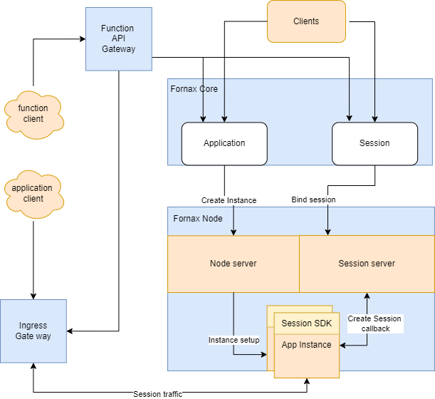

# Fornax serverless

## Scope
Fornax Serverless is targeted as general platform hosting serverless application or function. It features a lightweight and secure serverless platform.
Fornax manage two simple resources Application and Session, and use this two resources to support use cases of 

* Serverless application

Application is definition of how to run a container, it includes container spec, resource spec and config spec, application resource is only a spec, when client need to access an Application, it need to create a Session of an Application. 
When a Session is created, a instance is automatically deployed in fleet, and a session endpoint is created in ingress gateway to access this session.
when client done use a application, it can close Session, its instance and endpoint are also destroyed. Each application session will has its own instance, and its own session endpoint.  Session endpoint is accessible via ingress gateway.
In a multiple tenant environment, network policy is used to prohibit Application Session accessible by other tenants.

Application spec include auto scale policy, client can define idle session numbers and application instances are warm up already before session is created. whenever a session is required and there are warm up instances, it reduce session ready latency.
* Serverless function

Function is defined as application also, A Function gateway is responsible for create application for function, and create session to serve function call requests.
When a function call arrive API gateway, API gateway will open a new session or pick a existing session to issue this function request.
Sessions could be warm up by Function gateway to improve latency.

## Fornax serverless Components 

Here is an overview of system components.

Fornax serverless has only two major components, Fornax Core and Node Agent.
Fornax Core is control plane which provide api server, application and sessions scheduler, node register and resource monitor. 
It drive applciation instance and session implementation on every node and scale up application instances according sessions demand. 
there is only one Fornax Core required, user can always deploy a few more Fornax Core instance to ensure high availability. 

Node Agent is deployed on each node which application instance is deployed on, it implements application instance on node and open session on instance.
On each Node, there is also a session server deployed within NodeAgent,
each application instance must use a session SDK to talk with session server on node to get session request and ensure session state are monitored.

Application instance is deployed as a container. Fornax sererless Node Agent use CRI and containerd to deploy containers,
and choose Quark as container runtime,
Quark runtime is a secured light weight container runtime. it has fast start latency and low memory footprint.
Quark runtime also support hibernate container when container is idle, and fastly bring container back when request arrive. 
It help Fornax Serverless deploy standby containers with high density on a single node and reduce container cold start latency.

Ingress gateway works as a NAT gateway, is responsible for forward network traffic to Container service port.
Depends on network solution, there could be a multiple Ingress gateways or single Ingress gateways deployed outside each node.
It also can leverage node using port mapping if node itself has a externally accessible network address

Function gateway is a customer defined function, currently, it's not included in this project scope.

## Get Start With Fornax-Serverless
See our documentation on [Get Start](https://github.com/CentaurusInfra/fornax-serverless/blob/main/doc/get_start.md), You can setup and practice Fornax-Serverless application.
