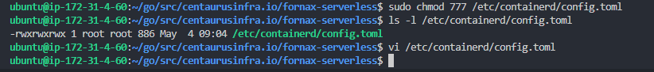

# ContainerD CRI Configuration and Setting

## Overview
Docker have docker daemon and containerd cri, General docker use docker daemon. The fornax-serverless platform use containerd cri to integration with Quark container. But docker have containerd cri and it is disable by default. this doc describe how to enable containerd cri plugins.


### I. Final containerd config.toml file and change the setting.
1. Run the folloing command to find out containerd config.toml file location.
```script
dpkg -L containerd.io | grep toml

```


2. Open config.toml by the following command
```script
sudo vi /etc/containerd.toml
```
note: if you cannot edit file, use following command to change file permission
```script
sudo chmod 777 /etc/containerd/config.toml
```


3. Comment line "disable_plugins = ["cri"]", see screen shot.
add # before "disable_plugins"


4. save and exit edit file window.

### II Restart containerd and check containerd status.
1. Run following command 
```script
sudo systemctl restart containerd
sudo systemctl status containerd
```

2. Check containerd status. see screen shot.
you can see containerd container runtime is active status.


### III Stop Docker Service (Docker Daemon).
1. If you already have docker service(Docker Application Container Engine Or Docker Daemon) and is in active. You need stop this service.
2. Check docker service status. see screen shot
```script
sudo service docker status
```

3. Stop Docker Service. see screen shot.
```script
sudo systemctl stop docker
sudo service docker status
```

