# Edge Serverless Platform
projet name: fornax-serverless

Wenjian Guo, Hongwei Chen

## Scope
Fornax-Serverless is targeted as general platform hosting serverless application or function. It features a lightweight, cost-effective, and secure serverless platform.

* Serverless application

Application is defined by api by a client, a application does not have instance deployed until a application session is created.
when session is created, a instance is automatically deployed in fleet, and a session endpoint is created in Ingress Gateway to access this session.
when session is closed, its instance and endpoint are also destroyed. Each application session will has its own instance, and its own session endpoint
After a session is setup. client access it's session via Ingress Gateway using session endpoint.
In a multiple tenant environment, network policy is used to prohibit session accessible from other tenants.

* Serverless function

Function is defined as application also, A Function gateway is responsible for create application for function, and create session to serve function call requests.
When a function call arrive API gateway, API gateway will open a new session or pick a existing session to issue this function request.
Sessions could be warm up by Function gateway to improve latency.

### Constraints
Targeted site size: 50~100 bare metal servers (each with >=16 CPU, >=32 GB memory)
Node Agent foot print: 0.5 cpu and 200M memory

## Requirements
### Functional Requirements
__Public API__
| method | functionality |
| ------ | --------- |
| Create application | Create application and its scaling policy definition; trigger creation of app instance pool |
| Update app scaling policy | Update application scaling policy |
| Delete application | Delete application and all its resources |
| Open application session | Take one open session from the ready session pool, mark it as actively started; returns its exposed endpoint |
| Close application session | Mark the application session as finished |

#### Performance targets
|  | latency (99%) | Throughput (per sec) |
|--| --------------------- | -------------------- |
| application | 50ms | 100 applications |
| application session| 50ms (with idle instance)   1.5s (cold start mode, excluding app initialization delay) | 100 sessions |

## Resource Model
Fornax serverless follow Kubernetes resource defintion spec, it has two externally exposed resources which is manageable from Fornax Serverless external API
Fornax Serverless provide a API server implemented with Kubernetes api server framework to expose External APIs for two external resoruces.
* application
* application session

Client can operate on these two external resources using any compatible Kubernetes clients.
e.g. A Client-Go sdk is generated to allow client to call api to operate and list watch these resources.
Operator can also use standtard kubectl command line to operate on these two resources.

Fornax serverless reuse some kubernetes resources definition internally to drive Node Agent and Ingress Gateway to implement workload.
including ConfigMap, Pod, Node port, Service all resources are namespaced are derived in format of “tenant name”.
These internal resources are not supposed to be visible or manageable to external clients at all.

here is a overview of resources and relationship

### Raw Resources
Compute node, having spec of hardware resource (CPU, memory disk capacity, network bandwidth) and the dynamic indicators (CPU utilization, free memory, available disk space, network consumption rate). 
Fornax-serverless, at current stage, only cares about the information that directly affects workload scheduling/execution (CPU/memory/volume).

## System Architecture
Fornax-serverless includes three main components, , Node Agent and Ingress Gateway.

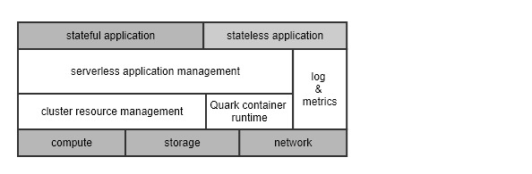

 is implemented as one single process which provides API service and controllers for external resoruces(application, sessions),
and schedules Pod and Service endpoint creation on Node Agent and Ingress Gateway to implement workload.

 also provide a grpc server which provide internal apis to Node Agent and Ingress Gateway.
Node Agent and Ingress Gateway connect to  and maintain a grpc streaming channel with Fornax Core.
Using this channel,  list/watch resources created on Node and Ingress Gateway, also send command message to Node Agent or Ingress Gateway to create/delete resources on node.

 reconciles internal resources reported from each compute node with Application/Application Session, it make sure workload is implemented and scale up/down workloads to meet desired status at any time.

Node Agent is deployed on each node which application instance is deployed on, it connect to  to register node status, receive Pod request and Session request, and send resource status back to the Fornax Core.
On each Node, there is also a session server deployed within Node Agent, each Pod must use a session SDK to talk with session server on node to get session request and ensure session state are monitored.

Application pod is deployed as a container. Fornax sererless Node Agent use CRI and containerd to deploy containers.
Node Agent choose Quark as container runtime, Quark runtime is a secured light weight container runtime. it has fast start latency and low memory footprint.
Quark runtime also support hibernate container when container is idle, and fastly bring container back when request arrive. 
It help Fornax Serverless deploy standby containers with high density on a single node and reduce container cold start latency.

Ingress Gateway is a network entity providing access to applications running on nodes.

##  Fornax Core Node Agent protocol
Fornax Core use grpc channel to talk with each Node Agent and Ingress Gateway, here are all messages and interactive sequence

### Node to  messages
- Configuration
  - Primary 
  - List of standby 
- NodeConfiguration
  - Node spec
- PodCreate
  - Pod spec
  - Config map spec
  - Secret spec
- PodTerminate
  - Pod name
- PodActive
  - Pod name
- SessionStart
  - Session spec
  - Pod name
- SessionClose
  - Session name

### Node to  messages
- NodeRegister
  - Node Ip
  - Node Resources
- NodeReady
  - Node Ip
  - Node Resources
- NodeState
  - Node name
  - Node Resources
  - Running Pods
  - Standby Pods
  - Running Sessions
- PodState
  - Pod name
  - Pod state, see Pod state lifecycle management
- SessionState
  - Session name
  - Session state, see session lifecycle management

###  Fornax Cor and Node Agent interaction sequence

it includes multiple interaction diagrams in below page

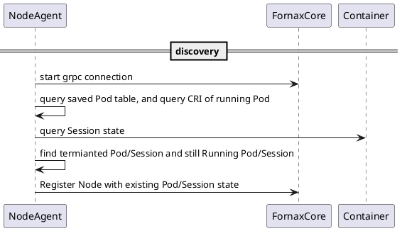

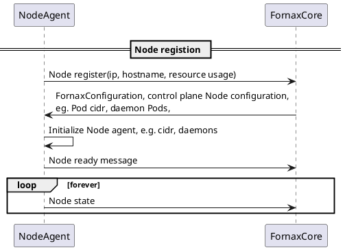

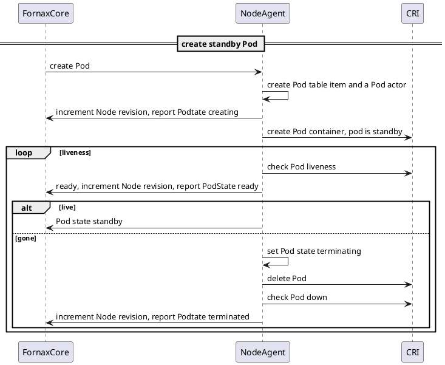

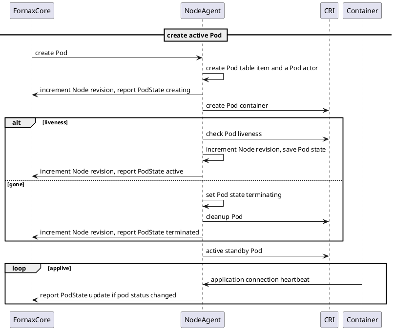

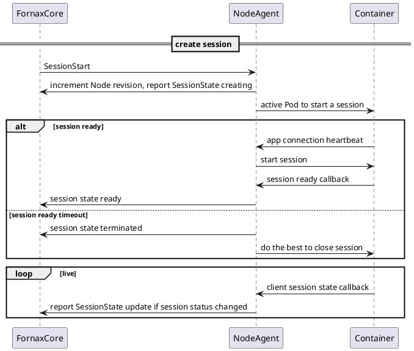

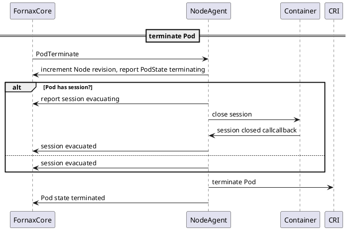

## Workload Scheduling
The critical performance trait is the latency to implement a workload: from client request (to claim a Application session) till the Application instance able to serve traffic passed in through the exposed endpoint. 

Traditionally Kubernetes use controllers and scheduler to drive implementation of a pod, there are a lot of back forth api calls between controllers/scheduler and api server, and asynchronous watch messages exchanges.
This method provides flexible framework to plug in scheduling rule and resources creation in workload implementation and decouple resource responsibility between different controllers, 
making Kubernetes highly extensible for introducing new resource types, but at the same time, instance starting latency is high since it require a lot of expensive Etcd operation.

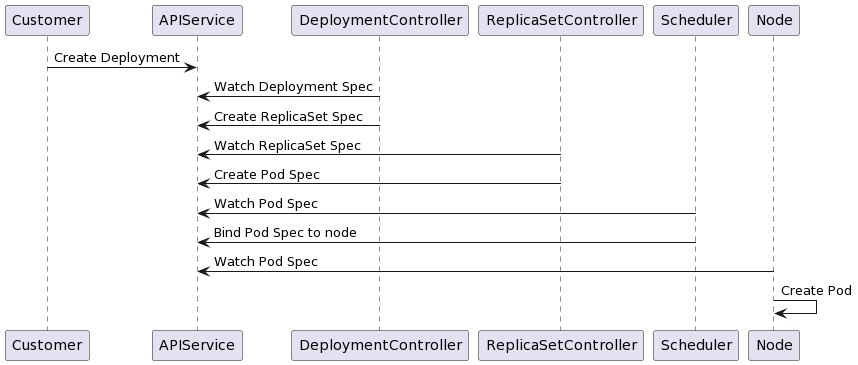

Fornax Serverless platform will simplify this relatively time-consuming workload implementation process by(_rough idea; may up to change when being implemented_)
* Node Agent does not use api to list/watch pod or session change to implement workload, pod and session request is scheduled by  and directly send to choosen Node via grpc stream channel,
  Node Agent get all necessary inforamtion to implement a workload, no need to check api server again to find required spec.
* Internal resources implementing a workload are saved in each Node,  do not need to do any internal resource persistance operation,
  Node Agent is responsible to save, monitor and reconcile workload resource status with  regularly whenever workload status changed on compute node.
*  build a internal state using Node Agent reported state, it save Fornax Core a lot of expensive Etcd operation,
  resource controllers will rely only on  memory, no api/message exchange between controllers and scheduler, Information are accessible directly inside Fornax Core internal memory.

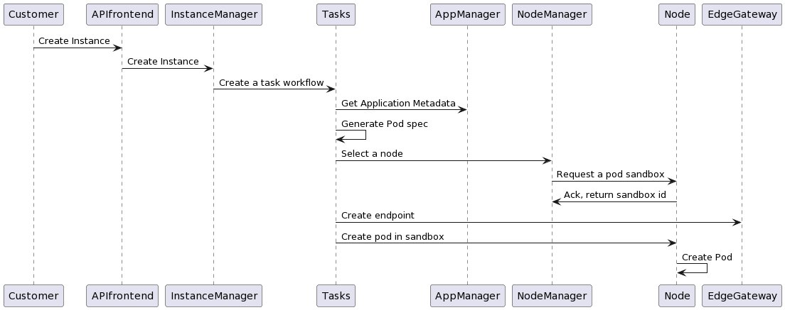

### Application Warmup
Each application session requires an container on Node to hold it, to reduce latency of openning an application session,
if there is standy containers ready for new sessions, open session will save all time consuming operations on Node to setup containers,
But warming up a lot of standby containers is not efficient to use Node cpu and memory resources.

Fornax Serverless balance low session open latancy and resource usage by
* automatically scale up/down application standby instances according session demands
* decrease standby container footprint and increase node deployment density.

## Availability Design

### Service availability
Fornax Core is a single process which includes API server and a group of resource controllers to drive implementation of workload on nodes,
multiple  can be deployed in cluster to achieve high availability.

Generally, Fornax Cores run in master/standby mode. Only one master Fornax Core is responsible for scheduling the workload resource to nodes. 
As workload resources are saved in each Node and Node is autority of workload integrity, Fornax Core build up its workload resource state by listen to Node Agent,
The standby Fornax Cores need to keep their their resource state in sync with master to make sure leader change will not lose these states,

Node Agent will connect to all Fornax Cores to report their states to make sure data is replicated across all nodes.
Node Agent and Fornax Core use incremental node revision to track the data syncronization between node and Fornax Core, 
Revison information is included in each messages Node agent sent, revision discontinoution will trigger Fornax Core to ask node a full sync of workload resources.

For external resource application or application sessions, they are modified using External api.
Master and Standby Fornax Cores rely on Kubernetes api list/watch to keep in sync.

### Data availability
There are two types of data stored in Fornax Serverless platform, Client application and application session resources, and internal workload resources, two types of data are store in different store.

* Application and Application session resources

Data is stored inside Fornax Core etcd db, they are visible and modifiable by client using external api, system rely on etcd to get data High Availability.

* Workload resources

Worload resources including instances and service endpoints which created to support application session, as they are implemented in each node, these information are saved in each node distributedly using a local sqlite db.
there is no HA for them given a node crash eventually means workload resources are lost already.
To note, Node Agent process crash will not lose data, Node Agent reload data from sqlite db and reconcile with containerd and session server to recover workload resource states.

As mentioned in above Service availability section, All Fornax Cores will sync workload resource state with each node via grpc stream channel.
It's similar to list/watch external resources and maitain workload resource high availability in side all Fornax cores.

### Resource sync between FornaxCore and NodeAgent
Every Node store its own resource spec and status of Node and Pods and Sessions on this Node, Nodes and Pods state are stored distributedly, 
FornaxCore use a list/watch method to keep inforamtion sync between FornaxCore and NodeAgents.
List/watch method are implemented by three messages using grpc channel between Fornax Core and NodeAgent.

* NodeState
* PodState
* NodeFullSync

Each NodeAgent will maintain a grpc channel with FornaxCore and use this channel to send Pod/Node state message when resource status changed.
* PodStateCreating => create
* PodStateRunning => update
* PodStateTerminate => delete
* NodeState => full list of pods on a node

When a Node Agent start. FornaxCore need to a full List of a node, especially all running pods on this node. 
NodeAgent send a NodeState message in Node register process to FornaxCore to include all running Pod state and its own node status,
FornaxCore then listen to PodState to start watching changes on each Node.

FornaxCore can also send a NodeFullSync message to Node Agent anytime when FornaxCore think it may do not have up-to-date node inforamtion.
But normally, FornaxCore just watch PodState to continuously find all changes on a Node.

#### Node Revision number
There are some scenarios FornaxCore and Node Agent are out-of-sync,
* grpc channel disconnected between FornaxCore and NodeAgent, 
* node restart or FornaxCore restart

To help FornaxCore need to find this out-of-sync state and re-List a node or ask resending PodState messages
Node Agent maintain a Node revision number on its side, each time there is a Pod/Node change, Node revision number is incremented, 
and added in each Pod/Node state grpc message.

Meantime, FornaxCore save latest Node revison number and compare it with revison in newly received Pod/Node state message. 
In normal case, node revision received by Fornax Core from a  Node should be incremented by 1 each time. if 
if there is a gap between save revision and new revision. it can determine three cases.

* There are greater gap between received revison and saved revision, then there is a missing state message, FornaxCore can request a NodeFullSync to ask Node send a full picture
* Received revison is less than saved revision, then received revison is older, message should be discard to avoid out-dated status change.
* Received revison is same as save revision, then received duplicated change.

Node Agent save node revision number in its own db, when Node Agent is restarted, it start from saved revision to help FornaxCore to keep tracking with node changes without disrupt.
Every node keep increment number from saved revision unless when store crash.
Node will treat itself as brand new Node and start from revision 0 again and cleanup all pods found in container runtime.

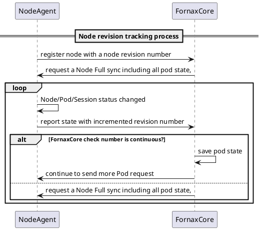

There is request to just ask Node to send missing PodState from last received revision to avoid to send full list of Pod on node.
but we currently to choose to send full list of Pod with two arguments.
* FornaxCore do not care about transit Pod State message, just need a last state
* Pods on a Node are relatively small number, sending a full list will not hurt FornaxCore performance a lot, but make NodeAgent logic simple to do not save a long backlog

## Fornax Core
Fornax Core works as a controle plane for resoruce controller, it include 

### Node management
Receives report of node status from Node Agent and keep node information up to date. this component is stateless by itself; node data is kept in the  memory and persistent to by external data store as well.

### Application Management
Application definition is stored in the data store. Whenever the core manager needs to access an application, it talks to the store.
Application can have multiple versions. Versions are immutable. Version numbers are generated in sequence by the System Manager.
Application of a certain version can be updated with scaling policy.
Image, exposed ports cannot be updated directly; instead, a new version should be created for image and ports change. Images are preloaded on nodes for the new version. 

### Session management
Control how to assing session to an application instance(pod), send session on a choosen pod, and maintain the mapping of access endpoints to application session running on nodes.
Whenever access endpoints changes, it will notify the Ingress Gateway to create or destoy port mapping.

### Instance Management
Instance manager scale up/down application instances to hold application session, tnstance manager triggers replenishing the instance pool according session demands. 
A application could warm up a bunch of idle instances and hibernate them to reduce memory/cpu consumption on node, and wake up them only when session demands comming.

## Node Agent
Node Agent include two main parts, node server, session server and pod port manager

Node server works as entry point with Fornax Core.
* It is responsible to register node and report node resources usages to Fornax Core,
* It is responsible to take pod request to create/terminate pods, and save and report workload resource changes.
* It work as proxy to take session request and work with session server to open/close session in pod, and report back sessio state.

Session server is a grpc server to allow pod connect to it via internal session managment api.
* Receive connection from pod and send request to pod to open/close session via this connection
* Receive session state from pod, and send session status change to Node server, eventually Fornax Core.

Pod port manager works with Ingress Gateway to maintain a mapping bween container port and it's externally accessible ingress endpoint.
* Assign ingress endpoint for pod's container port when pod is created, 
* Destroy ingress gateway when pod is termianted
* Setup network policy to prohibit pod connectivity from different tenants(TBD)

See our documentation on [Node Agent](nodeagent.md) for details.

## Ingress Gateway
Each application session is accessible via an endpoint on Ingress Gateway. Each gateway has one or several externally accessible network address,

Ingress Gateway could be implemented in two methods.

* Dedicated Ingress Gateway which is deployed outside node, works as a centralized entry point of cluster, multiple Ingres Gateways could be deployed to load banlance network traffic.

* On Node Ingress Gateway, in case of Node itself provide externally accessible network address, it can leverage container host port mapping technology to open a port on node,
  In this case, it use technology like IP tables to turn node as a NAT gateway.

## Function Gateway
Function Gateway is an API Gateway which take serverless function call request and forward to an application session,
It works as a Fornax serverless client which create application and session for a function via Fornax serverless external API,
and maintain mapping between function call API path with application session ingress endpoint.
It's highly cutomized product according clients requirement, and not included in this project scope.

## Log & Metrics server
Log & Metrics server collects application logs and metrics, publishes them to external services to allow customers to retrieve them at any time, e.g. AWS Cloud watch.

## Security Enforcement

### Service Authentication/Authorization
There are two parts that require different authentication and authorization: application/instance service (control plane), and instances (running in data plane).
Access to control plane should be protected by kubernetes api service authentication/authorization mechanism. which is detailed in design, just for Kubernetes method.

### Workload Authentication/Authorization

Clients of application, generally requires some form of authentication/authorization to make sure only authorized client can access a open session.
This is out of scope, left to the application developers' choice how to authenticate application user.

## Deployment
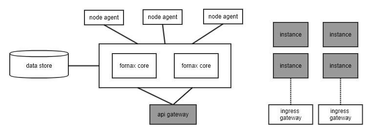

There are a few deployment units in this system.

| Unit | Deploy methods |
| ------ | ----- |
| Fornax Core | Master/Slaves |
| Etcd | Master/Slaves |
| Ingress Gateway | Active/Load balance |
| Node Agent | One on each node |
