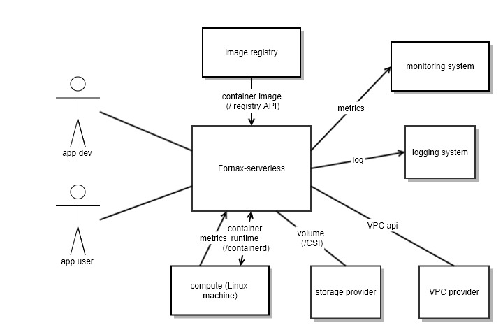
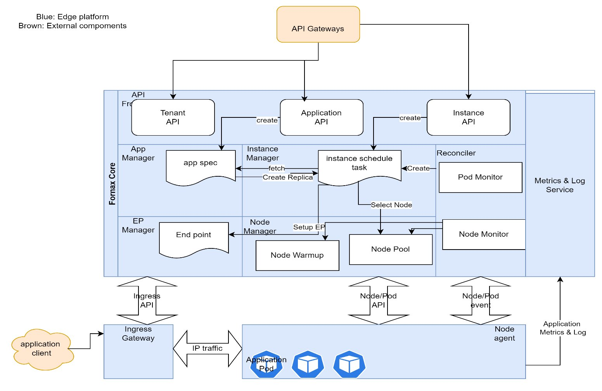

# Edge Serverless Platform
projet name: fornax-serverless

Wenjian Guo, Hongwei Chen

## Mission
Fornax-Serverless is targeted as a general-purposed serverless application management platform within an edge site. It features a lightweight, cost-effective, highly elastic, and secure serverless application management system. It strives minimum latency to provide workloads on demand.

Fornax-serverless is positioned as low-level resource management layer for upper layer SDK libraries (e.g. game dev SDK package).

## Scope

Fornax-serverless interacts with other dependencie as illustrated below

### Goals
1.  Support serverless applications (stateful/stateless)
	For both stateful and stateless applications, Fornax-serverless manages their instances’ lifecycle in serverless fashion, so as app developers not to concern themselves of server capacity planning and ops operations. Users pay per-use, not per resource allocated. It manages the applications and their instances life cycles, from creation, to scheduling, launching, and scaling, till termination.
	Stateful application instance has its own explicit life cycle. When an app is has done with execution, it enters end (like zombie process) state, and Fornax-serverless will reap it and release the resource. Stateless application has no state; Fornax-serverless will decrease running instances when user requests decrease, particularly will have 0 instance(zero-cost) if no user request is being processed.
2.  Manage cluster resources
	For cluster resources, Fornax-serverless abstracts away the compute/storage/network, manages hardware resources automatically, with minimum overhead.
3.  Use Quark as container runtime
	Application instances run as Quark containers. Fornax-serverless leverages Quark’s unique Standby/Ready mode to minimize idle footprint and optimize instance start latency.
4.  Provide secure execution environment
	as a shared application orchestration system, Fornax-serverless provides network isolation and multi-tenancy required by secure environment.

### No-goals
1. support lambda like serverless function
1. support event-triggering
1. support external/global resource management

### Terms
__Stateful application__

Each stateful application instance is different as it has its own state. Users of stateful application need to access the specific interesting instance. The instance’s lifecycle is controlled by the application itself with the help of the management system. To facilitate such stateful application life cycle management, there should be specific mechanism (app/instance management API) presented by system for application to handle the significant life cycle events. After an instance is terminated, it won’t come up again.

__Stateless application__

Stateless application instances do not keep states by themselves; they can be on/off anytime.

__Function__

Function, in context of serverless, typically is specified as a body of source code for one specific function. Fornax-serverless does not support it for now.

### Constraints
target edge site size: 50~100 bare metal servers (each with >=16 CPU, >=32 GB memory)

## Requirements
### Functional Requirements
__Stateful application public API__
| method | functionality |
| ------ | --------- |
| Create application | Create application and its scaling policy definition; trigger creation of app instance pool |
| Update app scaling policy | Update application scaling policy |
| Delete application | Delete application and all its resources |
| List instances | List instances of the application |
| Claim instance | Take one instance from the pool, mark it as claimed(occupied); returns its expose endpoint; may trigger replenishment of resource pool |
| Dispose instance | Gracefully delete the instance (with optional grace time); after the grace time, instance will be forcefully deleted |

__Stateless application public API__

TBD

### Quality Properties
#### Performance
Stateful applications have scaling policy expressed as max instances M, reservation ratio R(in % or number), optionally having min instances.

|  | Startup latency (99%) | Throughput (per sec) |
|--| --------------------- | -------------------- |
| Stateful app | 50ms (ready mode)   1.5s (standby mode, excluding app initialization delay)   2-5s (cold mode, excluding app initialization delay) | 100 app instance startup |
| Stateless app | TBD | TBD |

#### Security
Inside the system, Compute/network resources are isolated.

Public service interfaces should has secure protection.

#### Other requirements
Leveraging Quark container runtime unique standby/ready modes to optimize cold start.

## Data Model
### Application and Instances
Stateful application and instance

For types of ConfigMap, Pod, Secret,  their namespaces are derived in format of “tenant name-application name”.

Stateless Application and instance: TBD
### Raw Resources
Compute node, having spec of hardware resource (CPU, memory disk capacity, network bandwidth) and the dynamic indicators (CPU utilization, free memory, available disk space, network consumption rate). 
Fornax-serverless, at current stage, only cares about the information that directly affects workload scheduling/execution (CPU/memory/volume).

## Public API
API is defied in RESTful fashion.
### Application Management Service
1. Create application

Request
	HTTP Post
	Path: tenants/tenant-name/apps/
	Payload: app-spec
Response
	OK
Error
	Payload: {error: error-message}

App-spec has following significant fields:
tenant
app-name
instance template (similar to deployment template, including configmap and secret references if applicable)
scaling policy

2. Update application Scaling Policy

Request
	HTTP Put
	Path: tenants/tenant-name/apps/app-name
	Payload: scaling-policy
Response
	OK
Error
	Payload: {error: error-message}

App scaling policy has following significant fields:
Max active instances
App instance warmup pool (fixed num, or % of active instances)

3. Delete application

Request
	HTTP Delete
	Path: tenants/tenant-name/apps/app-name
Response
	OK
Error
	Payload: {error: error-message}

### Instance Management Service
4. Create instances

Request
	HTTP Post
	Path: tenants/tenant-name/app/app-name/instances
	Payload: instance spec
Response
	OK
		Payload: {id: instance-id}
	Error
		Payload: {error: message}

5. Get instance

Request
	HTTP Get
	Path: tenants/tenant-name/app/app-name/instances/instance-id
	OK
		Payload: instance spec + status
	Error
		Payload: {error: message}

6. List instances

Request
	HTTP Get
	Path: tenants/tenant-name/app/app-name/instances
	Query options: ?status=ready&limits=3 (to search for 3 open instances)
Response
	OK
		Payload: [ instance1, instance2, instance3…]

7. Claim instance

Request
	HTTP Put
	Path: tenants/tenant-name/apps/app-name/instances/instance-id
	Payload: {status: claimed}
Response
	OK
		Payload: {endpoint: exposed-endpoint}, which has format of tcp/udp-hostname/ip:port.
Error
	Payload: {error: error-message}

8. Dispose instance

Request
	HTTP Delete
	Path: tenants/tenant-name/apps/app-name/instance/instance-id
	Query options: ?gracetime=10s (by default 30s)
Response
	OK
Error
	Payload: {error: error-message}

### Tenant Management Service
_Minimum public API is offered to manage tenant resource for now; more comprehensive tenant management is not covered right now_

9. Create Tenant

Request
    HTTP Post
    Path: tenants/
    Payload: {tenant: tenat-name}
Response
    OK
    Error
        Payload: {error: error-message}

10. Delete Tenant
Request
    HTTP Delete
    Path: tenants/tenant-name
Response
    OK
    Error
        Payload: {error: error-message}

## System Architecture
### Overall Structure
Fornax-serverless system includes the fornax core (the system manager), ingress-gateway, plus node agents. There is also data storage which keeps all the critical data; this makes possible for the manager stateless to run multiple instances to avoid single point of failure.

Fornax core, running as one single process, provides API service and manages 4 major resources (app, instance, endpoint, and node). It schedules Pod creation on nodes and endpoint creation on ingress gateway; also reconciles with node agents of node and Pod status to monitor resource changes. Reconciler makes sure expected instances are running at any time.

Node agent runs on each node, creating/removing Pod as requested, and reporting node status and pod status back to the system manager. Node agent is customized on basis of Kubelet; the protocol of these reports is Kubernetes API calls for Node and Pod status updates.

Ingress gateway is a network entity providing access to application instances running on nodes. It is also used as the API gateway for upstream services (like gaming services) to access the public management API to manage the required resources.

### Instance Scheduling
The critical performance trait is the latency to implement a workload: from client request (to claim) an instance till the instance able to serve traffic passed in through the exposed endpoint. 

Traditionally Kubernetes use controllers and scheduler to drive implementation of a pod, there are a lot of back forth api calls between controllers/scheduler and api server, and a lot of asynchronous watch messages exchanges. This method provides flexible framework to plug in scheduling rule and resources creation in workload implementation and decouple resource responsibility between different controllers, making Kubernetes highly extensible for introducing new resource types, but at the same time, instance starting latency is high.

Fornax-serverless platform will simplify this relatively time-consuming workload implementation process by
* removing api/message exchange between controllers and scheduler, workload resource is implemented using a task workflow which is initiated directly by customer API call
* workload task workflow does not watch resource change, it’s executed inside service as a task creates Pod spec and Endpoint spec, and calls Node agent and Ingress gateway api to implement resources directly.
* node selecting is using the latest information that the Node manager maintains in its memory pool of nodes. The node manager uses sophisticated and efficient techniques (e.g. sorted priority queue), chooses a candidate node to place the workload to.
* API does not retry pod scheduling when create application instance api is called, API service return failure back to client when task workflow failed, let client to retry if workload is still required.
* Pod is rescheduled and recreated only by reconciler when pod of an implemented application instance crashes, and the application policy is recreating on failure.

### Sandbox pool of Node
Each node may have a pool of sandboxes under the management of node manager.

#### Pod Sandbox Warmup
A pod startup is a two-phases operation, creating a pod sandbox and starting containers inside a pod sandbox. Creating a pod sandbox include below steps
* Create Namespace
* Create Cgroup
* Apply Security policy on Cgroup
    * Run As user
    * Run As group
    *Run As root flag
* Create Pod Directory
* Create Pod Network
* Mount Config Map and Secret 

Some of the above steps are time-consuming operations including pod network and name space, to reduce pod starting time, Node manager will try to warm up node by 
1. create a few standby pod sandboxes on node when a node registers into cluster
2. replenish pod sandboxes on node when #standby pod sandbox is below a configured X threshold and node still has available resources.

To support pod sandbox warm up, Node Agent provides Apis including
* CreateSandBox
* DeleteSandBox

Config map and Secret are application specific resources, Node Agent mount config map and secret when real workload containers are started inside sandbox.

Besides warming up sandboxes by external api calls, Node Agent also actively recreates sandboxes when
1. workload finish
2. node running out of sandboxes and still have available resources

### Availability Design
Fornax core is a single process which includes API server and a group of resource managers to drive implementation of workload on nodes, multiple system managers can be deployed in edge cluster to achieve high availability.

Generally, fornax cores run in master/standby mode. Only one fornax core, the master, can schedule the instances to nodes. The other one, the standby, is able to receive and serve API requests – except for the instance scheduling which will be passed on and handled by the master.

When api request trigger new instances creation or termination, an instance schedule task is created, and are executed by the master only. When the master dies, a new master will be elected and resume the instance scheduling.

Resource managers use etcd to save all persisted api resources to ensure availability, meantime, node manager also maintains a memory copy of node information of cluster which is used to schedule instances, includes
* Node resources usages
* Node pod sand box pool
* Node running status

This information is changing all the time and not persisted in Etcd instead of memory, and information needs to be replicated between the master and standby system managers (e.g. use embed dsqlite to save this runtime information).

Alternative design is only the master accepts the app/instance API requests and process them. The standby will reject the request so that the ingress gateway to select others to send. This makes fornax core simple, at cost of bespoke logic in the ingress gateway and protocol of reject.

### Security Enforcement
Workload isolation is enforced by Quark, as a secure container runtime able to provide compute isolation. Network isolation is enforced by node agent:
1. Regular pods unable to access nodes (node should eb able to access pod for liveness/health check).
2. Pods could have 2 levels of isolation – isolation in unit of application, and isolation in unit of instance. Application spec decides which level for its instances.
3. Pods should be able to access external network, e.g., the internet.

VPC support, if available in the system, provides even stronger isolations between pods.

From outside, clients access the instances via the the ingress gateway by the exposed endpoints.

## Components
### Data store
Data store keeps all the critical data of application, instance, and node.
For cluster of size 50-100 nodes, it is estimated that 1GB sufficient for the data needs.

The latency of data store read/write should be less than 1ms for medium size payload (2-4KB).

Etcd is a natural choice for edge cluster with nodes less than 100: its performance seems ok with a few simultaneous connections (see https://etcd.io/docs/v3.3/benchmarks/etcd-3-demo-benchmarks/ for latency benchmark). Etcd fits well for active-passive mode.
### Fornax Core
The endpoints to access foxnax core are manually added as part of system bootstrapping process.

#### Application Management
Application definition is stored in the data store. Whenever the core manager needs to access an application, it talks to the store.
Application can have multiple versions. Versions are immutable. Version numbers are generated in sequence by the System Manager.
Application of a certain version can be updated with scaling policy.
Image, exposed ports cannot be updated directly; instead, a new version should be created for image and ports change. Images are preloaded on nodes for the new version. 
#### Instance Management
Instance manager provides API to manage stateful instances. Instance manager triggers replenishing the instance pool according to scaling policy.

Instance reuses Kubernetes Pod type for the workload. Its application link is defined as label “fornax/app”, endpoint link as label “fornax/endpoint”. The node link reuses spec.nodeName.

| Condition | Latency target |
| --------- | -------------- |
| Have Ready instance in pool | 99% <100ms |
| Have Standby instance in pool | 99% <1.5s |
| Out of stock in pool | 99% <5s (or 2-3s) |

#### Node management
Receives report of node status from node agent and keep node information up to date. This component is stateless by itself; node data is kept in the fornax core memory and persistent to by external data store as well.

#### Endpoint management
Maintain the mapping of instance to its endpoint mapping. Whenever it changes, it will notify the ingress gateway via its API.

### Ingress Gateway
This component is needed for an environment for external clients to access the public API offered by system manager, or access instance by the exposed endpoint. Fornax-serverless will provide an ingress gateway by adapting nginx-ingress (or HAProxy), as a reference implementation.

### Node agent
Mostly based on kubelet; expected to have some change to leverage Quark runtime’s standby/ready modes.

The specific mode is specified as “fornax/workload-mode” of Pod metadata.annotations. The values can be standby or ready, by default ready.

Node agents delegate Pod network connectivity setup to CNI plugin. Node agents also enforce Pod network isolations (TBD).

### Log & Metrics server
Log & Metrics server collects application logs and metrics, publishes them to external services to allow customers to retrieve them at any time, e.g. AWS Cloud watch.

## Authentication/Authorization
There are two parts that require different authentication and authorization: application/instance service (control plane), and instances (running in data plane).
Access to control plane should be protected by authentication/authorization. Ideally the auth mechanism is provided by edge/cloud IAM, which is out of this project’s scope.
Clients of instances, generally requires some form of authentication/authorization – if the instance requires so. This is out of scope, left to the application developers' choice how to authenticate application user.

## Deployment

There are a few deployment units in this system.

| Unit | Working mode | Deployment |
| ------ | ----- | ----- |
| etcd | Distributed Cluster | Container |
| Fornax Core | Master/Slave | Container |
| Ingress Gateway | Dual Active | Normal application |
| Node agent | One on each node | Normal application |
