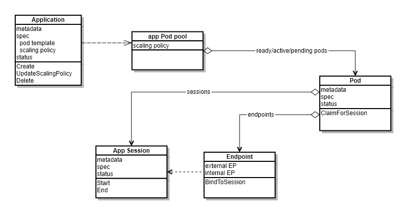
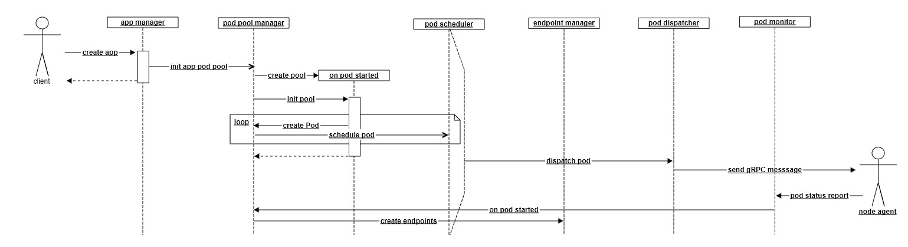
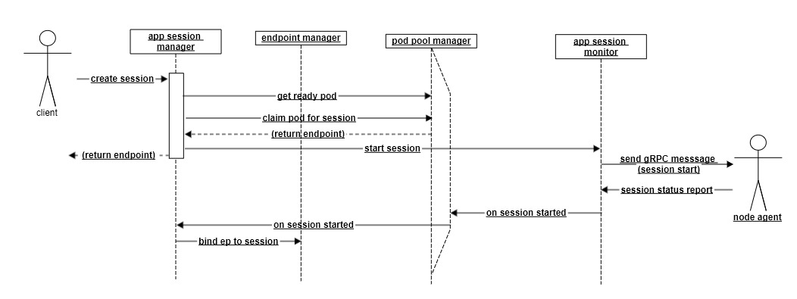

# Fornax Core Data Model

## Overview

### Eventual Consistency
For most of data (exceptions are namespace, application, and endpoints), Consistency across multiple fornax cores are achieved by every node agent syncing instance status to _ALL_ fornax cores. Instances takes node agent's status reports as the source of truth.

For namespace/application/endpoints, primary fornax core writes them to the data store. All fornax cores sync up by list/watch from etcd.

Primary fornax core does has slight discrepancy between secondary fornax cores in short period. For example, after Pod spec update is sent to node agent, before Pod status received from node agent; when all the fornax cores receive the Pod status report from the node agent, Pod data is consistent eventually.
### Little Disk Persisting
Almost all data is kept in memory, not persiting to data store. The only data types that need to wrtie to disk are namespace, application, and endpoint.

TBD: some data, like applications that have not been used for a long time but not deleted yet, would occupy memory w/o much benefit. A mechanism is desired to put them in secondary storgae, and load them into memory when they are been used.
### Significant Workflows


## Namespace manager
### Data structure
```golang
type NamespaceManager struct {
    namespaces map[string]Namespace // hashmap key is namespace name
}
```
### Algorithms
Lookup/insert/delete by namespace name is trivially amortized O(1).
### Syncing at Secondary
Fornax cores list/watch etcd with namespaces to maintain all namespaces. Primary fornax core has data already without list/watchings.

## Application Manager
### Data structure
```golang
type ApplicationManager struct{
    applications map[string]Application // hashmap key is namespace+application-name
}
```
### Algorithm
Lookup by namespace+app-name is trivially amortized O(1).
Inset/delete app itself takes O(1) time, however, it actually triggers creation/removal of Pods in its Pod pool.

Update-ScalingPolicy triggers creating/deleting ready app sessions, which in turn invokes app Pod pool manager to create/delete ready/standby Pods.

Update pod template triggers deletion of existent standby/ready Pods and creation with new template.
### Syncing at Secondary
Fornax cores list/watch etcd with application to maintain all applications. Primary fornax core has data already without list/watchings.

## App Session Manager
### Data structure
For now one app session for one app instance(Pod); app session name is same as Pod name.
```golang
type AppSessionManager struct{
    allSessions map[string]*AppSession  // index by ns+app-session-name
    appSessions map[string]AppSessionCollection  // index by ns+app-name

    pendingAppSessions []string // queue of ns+app-session-name 
}

type AppSessionCollection struct {
    pendings map[string]*AppSession //index key is ns+app-session-name
    actives map[string]*AppSession //index key is ns+app-session-name
}
```
### Algorithm
Create-session an app-session, triggers app-session start life cycle event to node agent, and returns its endpoint - if ready app session exists.
Otherwise, it returns __system busy, retry later__ error.
Start-session triggers creating ready Pod, unless application scaling policy disallows it.

End-session triggers termination session to node agent, marks the active app session terminating status. End-session may trigger creating ready Pod if necessary.

App session is created in pending status; when its status report is received from node agent, it is marked as fully active, and bind to proper endpoint.

App session is deleted after session monitor receives session status report as terminated. It triggers Pod temination to node agent. Alternative design is to provide option (as part of app spec) to keep Pod for reuse after session has been _cleanly_ finished.
### Data consistency
When node agent reposrts back app session status, fornax core ensure app session object up to date, achieving eventaul consistency across all fornax cores.

There exists short window discrepancy from primary fornax core sending app session related updates to node agent till all fornax cores receiving corresponding status report. In case the node agent is down (see more at node monitor section), primary core has to delete app session (and Pods on the node plus all the affected app sessions), and re-create them on other nodes if necessary. In case primary core is down, another secondary shall be elected as primary and resume - it might lead to temporary error; client retry should remedy. 

## Pod Pool Manager
### Data structure
```golang
type podPoolManager struct {
    allPods [map]*Pod    // gloable Pods, index by ns+Pod-name
    pendingQueue []string  // queue by inserting timestamp, element is ns+pod-name

    // application specific pools
    podPools map[string]AppPodPool // index by ns+app-name
}

// application specific pools
type AppPodPool struct {
    readyPods map[string]*Pod    // index by ns+pod-name
    standbyPods map[string]*Pod  // index by ns+pod-name
    activePods map[string]*Pod  // in-use, index by ns+pod-name
}
```
### Algorithm
Create-Pods(app *Application mode string, p int) creates p Pods in mode(ready/standby) state. It triggers Pod scheduling, followed by Pod dispatching.

Delete-Pod(pod *Pod) typically triggers Pod termination to node agent in O(1) time. If Pod already of terminated status, or the node is faulty, Pod is directly deleted.
### Data consistency
When fornax core receives Pod status report from node agent, it ensures to have corresponding Pod in memory. As node agent sends reports to all cores, it achieves eventual consistency.

In case Pod is in pending state, node agent does not respond with Pod status report, it would be stuck in Primary core. Primary fornax core runs go-routine to delete such Pods and replace with new one after specified period. It uses queue(slice) to get the oldest Pod in O(1). When a Pod is not in pending state, it still is kept in the queue; when it processes the Pod, it will finds status no applicable and just discard to process the next.
## Pod Scheduler
### Data structure
```golang
type PodScheduler struct{
    availableCPU map[string]int  // index by node name
    availableMem map[string]int // index by node name
}
```
### Algorithm
It scans availableCPU and availableMem tables to select the node for Pod, taking O(n) time given n nodes.

It supports batch scheduling to further optimize overall complexity to O(n+p), given p Pods in batch.

Ranking favors more available resources by default.

Alternative ranking design could consider node status refreshness into account, which may leverage node's lastUpdateTimestamp data.
### Consistency
Primary fornax core keeps availableCPU/Mem updated while processing Pod schedulings. For Secondary cores, it won't run pod scheduling and not maintain these while being secondary. However, when it becomes primary and before processing the first Pod scheduling, it will calculate them by aggregating all Pods kept in Pod pool manager.

Alternative is secondary cores maintain them as well on receipt of Pod status reports. Primary core needs to maintain extra table of already scheduled and not yet deleted to avoid double counts.

## Node Monitor
### Data structure
```golang
type NodeMonitor struct {
    nodes map[string]Node // hashmap index by node name

    nodeLocator map[string]*Element // hashmap index by node name, to locate the element in linked list directly
    updateTime LinkedList   // linked list of node name, sorted by times when status report received, header is the oldest one;
}

// element of doubly linked list
type Element struct{
    name string // name
    lastUpdateTime time.Time    // status report received timestamp
    next *Element
    prev *Element
}

// doubly linked list
type LinkedList struct {
    head *Element
    tail *Element
}

// omit the detailed implementations of its methods
```
### Algorithm
On receipt of node status report, it updates status section of the node object, and moves the element for the node to tail of lastUpdateTime list, in O(1) time.

Fornax cores have go-routine to detect stale nodes whose status report not updated in specified timeout. It uses the linked list updateTime, taking O(1) time practically. Receipt of Pod and app-session status refreshes last update time of the node too.

When fornax cores detect stale node, it triggers deletions of affected Pod/app-sessions; besides, primary core triggers creations of ready/standy Pods too.
### Consistency
Its nodes member is eventually consistent; nodeLocator and lastUpdateTime list are local maintained data.

## Pod Monitor
### Data structure
```golang
type PodMinitor struct{
    podPoolManager *PodPoolManager  // delegate pod op through the pod pool manager
    lastUpdateTime LinkedList   // linked list of ns+Pod-name, sorted by timestamp of the latest status report
    podLocator map[string]*Element // hashmap index by ns+Pod-name, to locate the element in linked list directly
}
```
### Algorithm
Similar to node monitor, it has go-routine to detect irresponsive Pods, taking O(m) time to detect m stale objects. app-session status report also refreshes Pod last update time.

TBD: standby pods may not make sense to report periodic status reports. Consider treating standby differently with regards to stale detection.

Primary fornax core acts on stale Pods - it triggers Pod deletion and re-creation via pod pool manager.
### Consistency
All its data is locally maintained; the last update timestamp of Pod is derived from node agent reports, which is same for all fornax cores.

## Session Monitor
### Data structure
```golang
type AppSessionMinitor struct{
    appSessionManager *AppSessionManager  // delegate pod op through the pod pool manager
    lastHealthUpdateTime LinkedList   // linked list of ns+app-session-name, sorted by timestamp of the latest health report
    appSessionLocator map[string]*Element // hashmap index by ns+app-session-name, to locate the element in linked list directly
}
```
### Algorithm
Similar to node and Pod monitor, it uses go-routine to detects stale sessions, taking O(m) time on each scan, geven m stale objects. Primary core triggers Pod termination on stale or ended app session.

Node agent is expected to report periodic session health updates to fornax cores.
### Consistency
lastHealthUpdateTime and toProbeHealth are derived from reports from node agents sending to all fornax cores.

## Endpoint Manager
### Data structure
```golang
type EndpointManager struct {
    gatewayIP string
    gatewayPortRange []int

    portBitVector    container.bitvector //bitvector for port numbers (1 for available), in 8KB
    nextAvailablePort int
    allocatedPorts  int

    endpointMapping map[string]EndpointMapping  // index by ns+app-session
}

type EndpointMapping struct {
    externalEndpoint Endpoint   // external ip:port
    internalEndpoint Endpoint   // internal ip:port
    namespace string   // vpc id
    appSession  string  // ns+ap-session name; app session bound to
}
```
### Algorithm
AllocateEndpoint allocate externl endpoint for an app session. DeleteEndpoint removes the mapping data for the app session.

It uses the nextAvailablePort to satisfy the current allocation, increasing allocatedPorts, and updates the nextAvailablePort to the next position of 1 bit. It takes O(8K) time to locate the next available port.
### Consistency
Gateway IP/port range is from start-up parameters. Port available/allocated data is from etcd data store, which primary fornax core writes.

Alternative design is secondary fornax core gets endpoint data from primary core w/o through etcd; open question TBD.