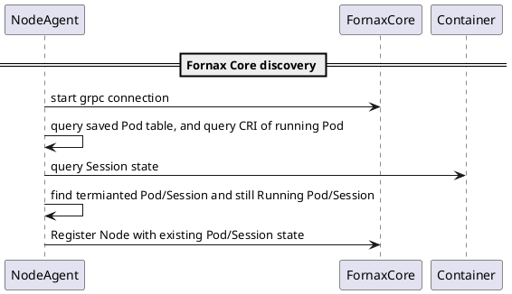
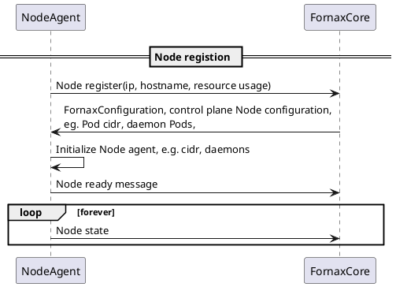
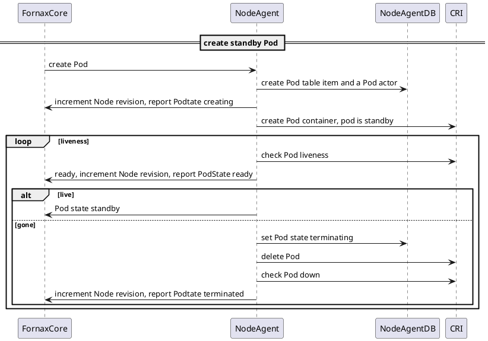
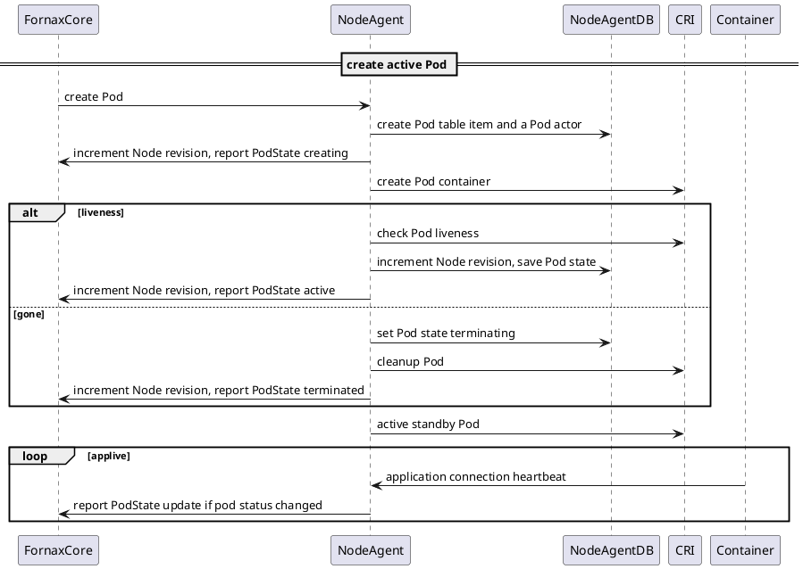
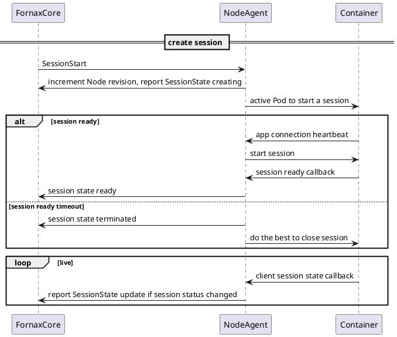
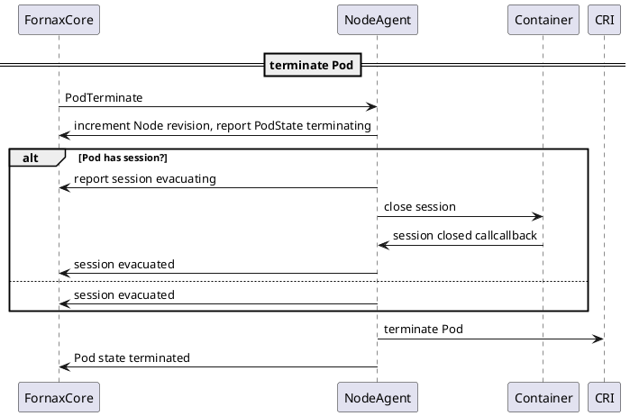
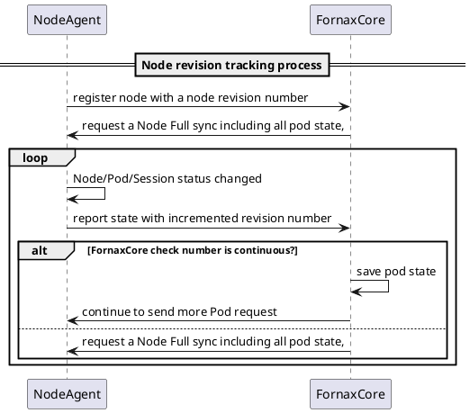
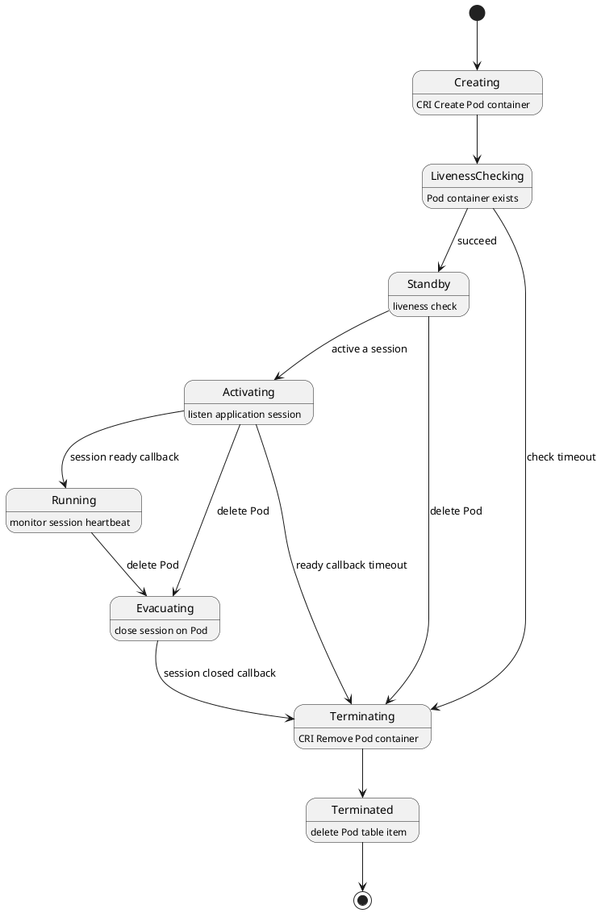
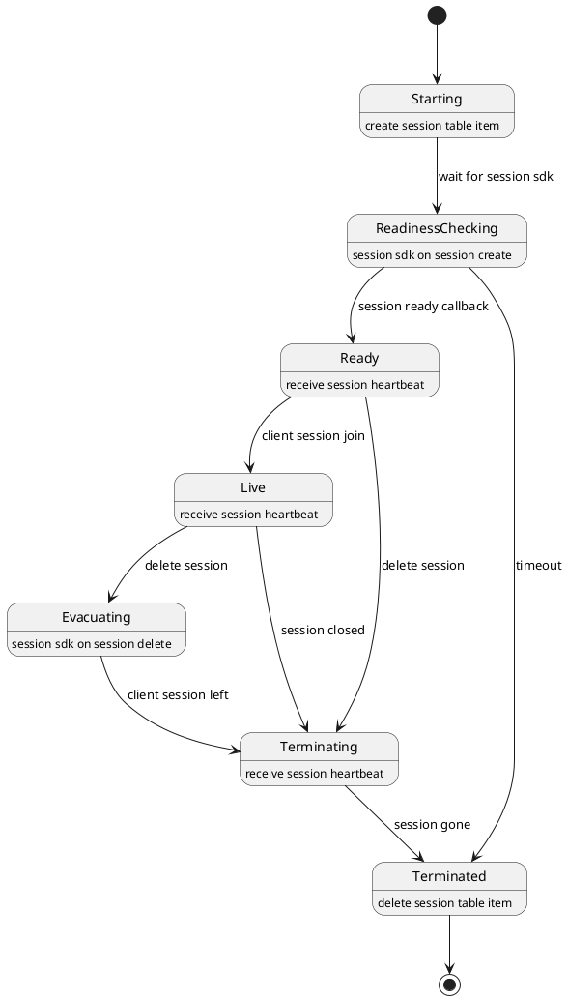

# Node Agent

Node agent provides services to help customers to deploy serverless applications and monitorX applications session status

FornaxCore uses k8s as internal driver force, but provides new apis to expose application resources, k8s apis are not exposed and hidden from customer.

It manages the following Fornax serverless resources on Node agent:

- Application instance

Application instance is basically a Pod, application could have multiple Pods work as a service, or work independently, an entry point is exposed to allow customers to access exposed application (application protocol are application specific)

Some Application instances work as a daemon, it processes data provided by other internal or external applications. E.g., Streaming data processing.

- Application Session

An application session is created and returned to customers when customers want to use an application, an instance is chosen to serve this session or created to serve this session if there are no idle application instances

It also provides method to monitor

1/ application resource usage

2/ application logs

3/ application metrics

Since customers will not get k8s access, this information needs to be collected and stored to allow customers to access it.

# Node agent components

When NodeAgent started it connect to FornaxCore and start to exchange messages encoded using protobuf. FornaxCore is implemented as a gRPC service, it provides two apis SendMessage and GetMessage.

NodeAgent use SendMessage to notify FornaxCore and use GetMessage to receive response or any other command request. FornaxCore implements SendMessage as a unary async api, and FornaxCore implements GetMessage as a streaming API to allow NodeAgent to receive response message or other command message from FornaxCore asynchronously.

when NodeAgent firstly connects to FornaxCore, it needs to start a registration process to sync its data with FornaxCore, also FornaxCore send back NodeConfiguration back to let NodeAgent to finish necessary initialization. Then NodeAgent notify FornaxCore it&#39;s ready for workload.

Node agent is deployed on each Node as a daemon, In each Node Agent, there is one Node Actor is created to handle Node resource messages and Node registration with FornaxCore, it also maintain heartbeat between NodeAgent and FornaxCore.

And multiple Pod Actors and Session Actors according to how application instances and sessions are created on this Node, these Actors will handle their own Pod and session messages.

## FornaxCore to Node messages

These messages are mostly command message to request Node to execute

- FornaxCoreConfiguration
  - Primary FornaxCore
  - List of standby FornaxCore
- NodeConfiguration
  - Node spec
- PodCreate
  - Pod spec
  - Config map spec
  - Secret spec
- PodTerminate
  - Pod name
- PodActive
  - Pod name
- SessionStart
  - Session spec
  - Pod name
- SessionClose
  - Session name

## Node to FornaxCore messages

are mostly message about Node, Pod and Session State.

- NodeRegister
  - Node Ip
  - Node Resources
- NodeReady
  - Node Ip
  - Node Resources
- NodeState
  - Node name
  - Node Resources
  - Running Pods
  - Standby Pods
  - Running Sessions
- PodState
  - Pod name
  - Pod state, see Pod state lifecycle management
- SessionState
  - Session name
  - Session state, see session lifecycle management

## FornaxCore Node Agent interaction diagram

it includes multiple interaction diagrams in below page

##  Workload resource sync between FornaxCore and NodeAgent
Every Node store its own resource spec and status of Node and Pods and Sessions on this Node, Nodes and Pods state are stored distributedly, 
FornaxCore use a list/watch method to keep inforamtion sync between FornaxCore and NodeAgents.
List/watch method are implemented by three messages using grpc channel between Fornax Core and NodeAgent.

* NodeState
* PodState
* NodeFullSync

Each NodeAgent will maintain a grpc channel with FornaxCore and use this channel to send Pod/Node state message when resource status changed.
* PodStateCreating => create
* PodStateRunning => update
* PodStateTerminate => delete
* NodeState => full list of pods on a node

When a Node Agent start. FornaxCore need to a full List of a node, especially all running pods on this node. 
NodeAgent send a NodeState message in Node register process to FornaxCore to include all running Pod state and its own node status,
FornaxCore then listen to PodState to start watching changes on each Node.

FornaxCore can also send a NodeFullSync message to Node Agent anytime when FornaxCore think it may do not have up-to-date node inforamtion.
But normally, FornaxCore just watch PodState to continuously find all changes on a Node.

### Node revision number
There are some scenarios FornaxCore and Node Agent are out-of-sync,
* grpc channel disconnected between FornaxCore and NodeAgent, 
* node restart or FornaxCore restart

To help FornaxCore need to find this out-of-sync state and re-List a node or ask resending PodState messages
Node Agent maintain a Node revision number on its side, each time there is a Pod/Node change, Node revision number is incremented, 
and added in each Pod/Node state grpc message.

Meantime, FornaxCore save latest Node revison number and compare it with revison in newly received Pod/Node state message. 
In normal case, node revision received by Fornax Core from a  Node should be incremented by 1 each time. if 
if there is a gap between save revision and new revision. it can determine three cases.

* There are greater gap between received revison and saved revision, then there is a missing state message, FornaxCore can request a NodeFullSync to ask Node send a full picture
* Received revison is less than saved revision, then received revison is older, message should be discard to avoid out-dated status change.
* Received revison is same as save revision, then received duplicated change.

Node Agent save node revision number in its own db, when Node Agent is restarted, it start from saved revision to help FornaxCore to keep tracking with node changes without disrupt.
Every node keep increment number from saved revision unless when store crash.
Node will treat itself as brand new Node and start from revision 0 again and cleanup all pods found in container runtime.

### NodeAgent FornaxCore revision tracking process

There is way to just ask Node to send missing PodState from last received revision to avoid to send full list of Pod on node.
but we currently to choose to send full list of Pod with two arguments.
* FornaxCore do not care about transit Pod State message, just need a last state
* Pods on a Node are relatively small number, sending a full list will not hurt FornaxCore performance a lot, but make NodeAgent logic simple to do not save a long backlog

### FornaxCore cluster support

System operator can setup a cluster of FornaxCore to manage Node Agents, this cluster could be in active/standby mode or partitioned active/active mode.

Operator provision NodeAgent using a list of seed FornaxCore, NodeAgent setup connection to these seeds, and send NodeRegister message to all of them.

If none of these seeds are primary FornaxCore of this Node, FornaxCore send back a new FornaxCoreConfiguration including list of FornaxCore Ips and primary owner of this Node. NodeAgent reset its connection to primary one and start register again.

Whenever FornaxCore cluster change a Node ownership, it will notify Node about new configuration, this information could also be included as an in-bind data in other command messages send to NodeAgent.

## Legacy Kubelet http server

Kubelet provides some apis to allow attach/exec command on Pod and collect Pod logs and metrics. These management apis are important to allow operators to monitor their instances.

## Node Actor

When Node Actor started, it&#39;s responsible for setup connection with FornaxCore and registers itself.

Node Actor act as entry point to receive command and configuration messages from FornaxCore, it keeps connection alive and setup new connection when FornaxCore change Node ownership.

When Node Actor start, it report persisted Pod and session state to FornaxCore, also work as proxy of state/message change for Pod/sessions.

## Pod Actors

Pod Actors work as a state machine to act on each Pod or session.

Whenever Pod or session state changes, it uses Node actor to send messages back to FornaxCore.

Created for each app Pod, it talks with container runtime

1 create app Pod

2 active standby app Pod

3 Pod liveness and readiness probe

4 react to Pod lifecycle event, Pod start/stop

### Pod lifecycle management

Application instances use Pod and container to host customer application, a Pod Actor work as state machine, it has different behaviors in different state, state transit when Pod actor receives Fornax core command messages or receive internal lifecycle events.

## Session Actors

Session actor with with Pod Actor to active a session on a Pod and talk with application using Session SDK to probe session state, also maintain client session associations, same as Pod actor, a session actor is created for each session, and it works in a state machine mode also.

When application session is setup, application container is supposed to send heartbeat message back continuously, if heartbeat is not received, session is flagged in as state messaged send back to FornaxCore, it&#39;s up to FornaxCore to determine if it want to close this session.

### Application session lifecycle management

Application sessions go through the states below from customer begin a session until session is ended.

A Session service is provided as a local gRPC service, Session Service provide similar api as FornaxCore gRPC service to send and receive messages from application, a sdk is provided to allow aplication to connect to Session Service when application container is initialized and started, container sends session event and heartbeat message back to Session Service, also Session Service send command message to application to setup or tear down some internal states.

### Session command message

message is sent to server when Customer call StartApplicationSession and CloseApplicationSession.

- SessionStart
- SessionClose

### Session callback message

Node agents provide a few apis to allow application call when session is in a state, e.g. session is initialized inside application instance, or session is clear.

- SessionReady
- SessionEvacuated
- SessionClosed

Node agents create a certificate on-fly for each application instance when instance is created, application instance uses this certificate to talk to Node agent and authorize only issued certificate can only change associated sessions with this instance.

### Session configuration

Customer can provide some customized data in session and application spec to allow instance and Session use this data to initialize, Node agent create an application instance and sessions metadata file for each instance on this Node, and mount it as a read-only file inside container, Node agent will write this file whenever some runtime configuration changed of an application instance.

## Node reconciler

To let Node agent to recover from crash or message loss, Node Agent saves all Pod and session information in its own SQLite db. meantime a Node conciliar use this saved information to check with Containerd and Session Service to make sure Pod and session are implemented or cleaned properly.

This information is also reported back to FornaxCore as Application Instance and Session authority.

Except Node startup or recovery, Node reconciler is also doing some housekeeping work to

## CRI Proxy

Fornax serverless plan to onboard on quark container runtime, one difference with standard runc runtime is.
squark container will provide a standby/active mode to run a container, a standby container is not fully bootstraped and paused on entry point,  consume lower CPU and memory, standby containers can be activated when it's needed to put into service quickly.

### onboard Quark runtime

Containerd define a [default oci runtime](https://github.com/containerd/containerd/blob/main/pkg/cri/config/config_unix.go#L76) to use runc, to use quark standby and resume feature, here are some changes may need

### Standby container

Still use standard CRI Create Container and Start Container apis, a container spec is created by containerd to call runtime Create and Start method, in container spec, a path through annotation is provided to let

process pause on provided memory threshold, this memory threshold is put into [container spec](https://github.com/opencontainers/runtime-spec/blob/main/specs-go/config.go#L20) as a [oci annotation which passthrough from cri container config](https://github.com/containerd/containerd/blob/bb8b134a17974a49c448e3368bd75954810cd86d/pkg/cri/server/container_create_linux.go#L280), or [cri Pod config](../containerd/container_create_linux.go%20at%20bb8b134a17974a49c448e3368bd75954810cd86d%20%C2%B7%20containerd/containerd%20(github.com)).

[k8s Pod config is easy place to put this customized config since it&#39;s just a copy from Pod spec](https://github.com/kubernetes/kubernetes/blob/master/pkg/kubelet/kuberuntime/kuberuntime_sandbox.go#L90)

[cri container config is selected attributes only](https://github.com/kubernetes/kubernetes/blob/537941765fe1304dd096c1a2d4d4e70f10768218/pkg/kubelet/kuberuntime/labels.go#L107),

The Node agent only needs to put an annotation into Pod spec, and quark runtime will check this annotation to standby or fully active.

### Active container

Container runtime method does not have active syntax, there are two methods which can be repurposed for a hack,

Option 1, pause and resume

use containerd PauseTaskRequest and ResumeTaskRequest,

Option 2, kill using sig\_user1/2 signal
repurpose containerd KillRequest to send user sinal

[Here is containerd task service definition](https://github.com/containerd/containerd/blob/main/api/services/tasks/v1/tasks.proto#L31)

add a new cri stopContainer implementation to use KILL

[Default cri stopContainer implementation](https://github.com/containerd/containerd/blob/main/pkg/cri/server/container_stop.go#L112) use SIG\_TERM or SIG\_KILL to stop a container.

## NodeAgentDB

NodeAgent persist Pod and Session information in its own SQLite db, hence two tables are created.

Pod Table

| Pod name | Namespace/name, unique id |
| --- | --- |
| Pod spec | K8s spec |
| Pod state | Fornax Pod state lifecycle management |
| Pod runtime status | Created by CRI |
| Config spec | K8s spec |
| Secret spec | K8s spec |
|

Session Table

| Session name | Namespace/name, unique id |
| --- | --- |
| Session spec | Fornax spec |
| Pod name | Namespace/name, unique id |
| Session state | Session lifecycle management |

Node Table

| Node name | unique id |
| --- | --- |
| Node spec | host name |
| Node revision | revision tracking number with Fornax core|

